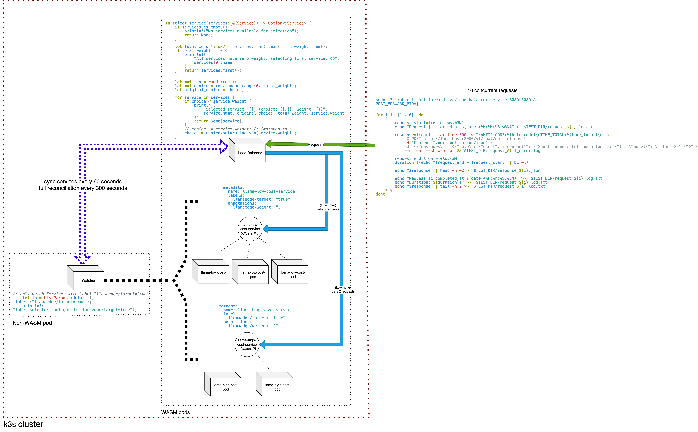

# Project Summary 

## LFX Mentorship: Use Runwasi with WasmEdge runtime to test multiple WASM apps as cloud services

```sh
Mentors:       Vincent Lin, Yi Huang
Mentee:        Vatsal Keshav
Organization:  CNCF/WasmEdge
Duration:      3 months (June 9, 2025 - August 29, 2025)
```

### __Overview__

*What was the motivation behind this project?*

With WasmEdge serving as one of Runwasi’s standard runtimes, and as its C++-implemented library continues to evolve, there was a need for a verification process integrated into Runwasi to streamline and validate the stability of both container and cloud environments.

*and how did it happen?*

The project comprised of these steps - (which were also completed in the same order)
 1. Research the relevant codebase, tools, and environment setup procedures.
 2. Verify the system’s behavior under Kubernetes (k8s).
 3. Confirm how the plugin system should be configured in a k8s environment — for example, environment variables or dynamic library (plugin and plugin dependencies) loading paths.
 4. Create a CI repository that we could use to verify the integration yourself and show results.
 5. For the creative aspect, explore how to integrate HTTP service and the plugin system in a multi-node setup. The goal was to showcase how this ecosystem can be effectively deployed in the cloud.

### __Deliverables__

*The deliverables planned were :*

 1. Github workflow in https://github.com/second-state/runwasi-wasmedge-demo to
        - Verify Configuration of the WASI-NN plugin in k8s
        - Run some pod tests as daily CI for monitoring purpose
 2. Integrating the WasmEdge-WASI-NN plugin system and an HTTP service in k8s environment
        - To showcase how this ecosystem can effectively deployed in the cloud

*Final deliverables completed :*

 1. Github workflow in https://github.com/second-state/runwasi-wasmedge-demo : https://github.com/second-state/runwasi-wasmedge-demo/pulls
    - It verifies configuration of the WASI-NN plugin in k8s
    - Also has pod tests for monitoring purpose

 2. A demo showcasing integration of the WasmEdge-WASI-NN plugin system and an HTTP service in k8s environment : https://github.com/vatsalkeshav/load-bal-llamaedge-demo
    - This demo features LlamaEdge's llama-api-server (as WASM-pods) runnning different gguf models in a multi-pod environment - all managed by a load-balancer (also a WASM-pod) - assisted by a service-watcher utilizing kube-rs client (a regular non-WASM pod)
    

### __Impact__
This project demonstrates a real-world scenario as to how WASM workloads can efficiently replace traditional container/vm/etc. approches of cloud deployment.

 - *__LlamaEdge writing AI servers to run on the edge (in Rust too!)__*
 - *__WasmEdge replacing traditional containers with WASM ones__*

these are the 2 of the *biggest leaps in tech of our decade* and thanks to this mentorship program, I had the opportunity to work with them.

### __Future Work__
The `service-watcher` from `load-bal-llamaedge-demo` is still run a non-WASM pod because it uses `kube-rs` and `k8s-opensapi` as dependencies which in turn depend on
```sh
reqwest → hyper → tokio → socket2
```
all of which assume native sockets, threads, and system TLS (Refer cargo tree of kube-rs and k8s-openapi : https://github.com/vatsalkeshav/load-bal-llamaedge-demo/blob/master/watcher/cargo.md)

While WasmEdge provides forks like `tokio-wasi`, `reqwest-wasi`, `hyper-wasi`, `socket` etc. - `kube-rs` has hard dependencies on the native crates, so they won’t link without patching `kube-rs` itself. Given this, running the watcher as a traditional pod seems more practical for now but there'd be nothing better if the service-watcher would complile to wasm32-wasip1 target.

### _Acknowledgements_
```sh
“The mirror reflects not just your image, but the story of your strength, resilience, and grace.” 
- Dalai Lama
```
My growth here is a reflection of your guidance - your steady support through challenges and encouragement in successes - Thank you [Vincent Lin](https://github.com/CaptainVincent) and [Yi Huang](https://github.com/0yi0)

I'm also glad to be a part of and to be helped by the [WasmEdge](https://cloud-native.slack.com/archives/C0215BBK248/p1754502803786039) and [Runwasi](https://cloud-native.slack.com/archives/C04LTPB6Z0V/p1754502430462249) communities.

Thanks [@hydai](https://github.com/hydai) for helping me with the dns resolution (: